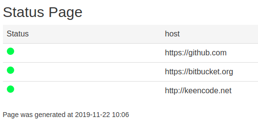

# status_page
StatusPage is a latency logging and graphing alerting system, based on aws services.
## Deploy CF template:
```
./CreateStack.sh <aws_account_id> <aws_profile_name> <aws_region> <stack_name>
```

## Status page



